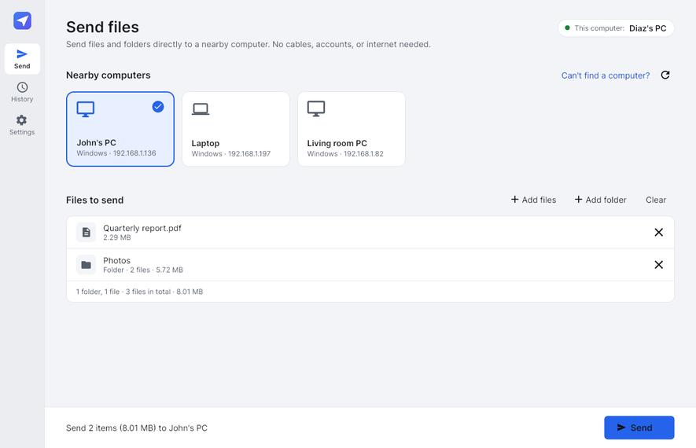
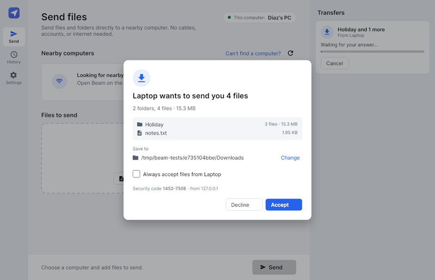
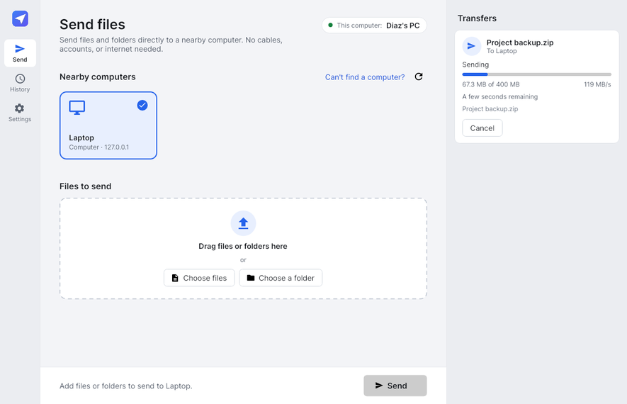
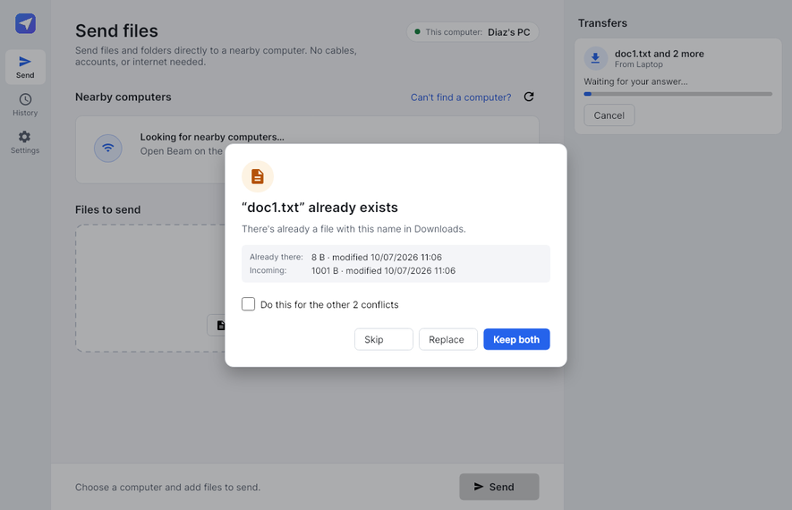

# Beam

**Send files directly between nearby computers.** Open Beam on two computers on the same network, pick the
other computer, drop in files or folders, and they arrive — encrypted, verified, and with their folder
structure intact. No cables, accounts, cloud, IP addresses, or network shares.



| Incoming request | Transfer in progress | Name conflicts |
|---|---|---|
|  |  |  |

## Features

- **Automatic discovery** of nearby computers (Wi-Fi, wired LAN, Windows Mobile Hotspot). Computers appear and
  disappear on their own. If a network blocks discovery, **Connect by address** is the fallback — only one side
  needs to type the address shown in the other's Settings.
- **Send files and whole folders** by drag-and-drop or file pickers. Folder structure, empty folders, Unicode
  names and modification times are preserved. Thousands of small files and multi-GB files are both fine.
- **The receiver decides**: "Diaz's PC wants to send you 3 files" with names, sizes, destination folder (changeable
  per transfer), free-space check, and Accept/Decline. Optional "Always accept from this computer".
- **Existing files**: Replace / Keep both / Skip, with "do this for all".
- **Live progress**: files done, bytes, speed, time remaining, current file. Several transfers can run at once.
- **Reliable**: dropped connections reconnect and **resume where they stopped** (even if the receiving app was
  closed or crashed). Every file is verified with SHA-256 before it is moved into place; a damaged file is
  re-sent automatically. Partial data never masquerades as a finished file.
- **Secure**: mutually-authenticated TLS between devices, certificate pinning, approval required by default,
  received paths can never escape the chosen folder. No admin rights, no cloud, no telemetry.
- **Windows integration**: tray icon (keeps receiving when the window is closed), toast notifications,
  start with Windows, single instance, `Beam.exe --send <paths>` for future Explorer integration, light/dark theme.
- Friendly errors ("Connection was lost…") with technical details one click away and in a log file.

## Install / run

**From a release build:** run `BeamSetup-<version>-x64.exe` (per-user install, no administrator rights), or just run
the standalone `Beam.exe` — it is a single self-contained file (~31 MB) that needs nothing else installed.

On first launch Windows may ask whether Beam can use the network: choose **Allow** (private networks). Beam explains
this on its welcome screen. Installing "for all users" adds the firewall rule automatically.

Requirements: Windows 10 (1809) or Windows 11, x64 or ARM64.

## Build from source

Requires the [.NET 8 SDK](https://dotnet.microsoft.com/download) (or newer).

```powershell
# Windows: run tests, publish Beam.exe, build the installer (needs Inno Setup 6)
./build.ps1 -Installer
# Output: artifacts/publish/win-x64/Beam.exe and artifacts/installer/BeamSetup-1.0.0-x64.exe
```

```bash
# Linux/macOS (development and CI): run all tests and cross-publish the Windows exe
./build.sh            # or: ./build.sh win-arm64
```

Run the app during development with `dotnet run --project src/Beam.App -f net8.0`. To run two instances on one machine
(for testing), give each its own data folder: `BEAM_DATA_DIR=C:\temp\beam2 dotnet run --project src/Beam.App -f net8.0`.

> Avalonia, the UI framework, collects anonymous **build-time** usage statistics (never anything at runtime or from
> users of Beam). Set `AVALONIA_TELEMETRY_OPTOUT=1` before building to opt out.

## Project layout

| Path | What |
|---|---|
| `src/Beam.Core` | Cross-platform engine: discovery, protocol, transfers, resume, security, settings, history. No UI. |
| `src/Beam.App` | Windows desktop app (Avalonia, MVVM): views, view models, tray, notifications, Windows integration. |
| `tests/Beam.Core.Tests` | Engine tests: real two-device transfers over loopback TLS, failure injection, resume, security. |
| `tests/Beam.App.Tests` | Headless UI tests that drive real transfers through the UI and render screenshots. |
| `installer/Beam.iss` | Inno Setup installer script. |
| `docs/` | [Architecture](docs/ARCHITECTURE.md), [wire protocol](docs/PROTOCOL.md), [testing & manual test plan](docs/TESTING.md). |

## Troubleshooting

| Problem | What to do |
|---|---|
| The other computer doesn't appear | Make sure Beam is open on both and both are on the same network. Check Windows Firewall allows Beam on *Private* networks (Settings → Privacy & security → Windows Security → Firewall → Allow an app). Some guest/public Wi-Fi networks isolate devices — use **Can't find a computer? → Connect by address**. |
| Network is set to "Public" | Windows blocks incoming connections on Public networks unless allowed. Switch the network to Private, or allow Beam for Public networks in the firewall prompt. |
| Window is blank/black | Start Beam with `Beam.exe --software-rendering` (graphics driver problem). |
| Need technical details | Settings → About → **Open log folder** (`%LOCALAPPDATA%\Beam\logs`). |

Beam stores its settings, history and device identity in `%LOCALAPPDATA%\Beam`. It never keeps copies of transferred files.
